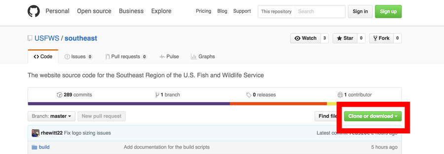

# Getting Started

This website is the amalgamation of many free and open source tools.  Before you get started you'll need to make sure you have a few things installed.

## Requirements

- [NodeJS](https://nodejs.org/en/) version 9 (Roy is currently on 9.5.x)
- [Hugo](https://gohugo.io/overview/installing/) (Roy is currently using v0.39)
- [Git](https://git-scm.com/downloads) (Roy is currently using 2.10.1 [Apple Git-78])
- [Sharp/libvips](http://sharp.dimens.io/en/stable/install/#installation)

### Mac OSX
`libvips` is a utility required by [Sharp](http://sharp.dimens.io/en/).  On a mac with [homebrew](http://brew.sh/) installed run `brew install homebrew/science/vips` in your terminal. **We should look at another photo re-sizing utility if we can avoid this extra install/dependency.**

### Windows
`libvips` is included with the installation of [Sharp](http://sharp.dimens.io/en/) on Windows.  I ran into issues installing Sharp due to errors from [node-gyp](https://github.com/nodejs/node-gyp).  Installing [Visual Studio Community](https://www.visualstudio.com/en-us/products/visual-studio-community-vs.aspx) **with C++ tools, which are not installed by default** solved the issue.

For more information check out the tread on [GitHub](https://github.com/nodejs/node-gyp/issues/629#issuecomment-153196245).

**Keep in mind this site was developed using a Mac.  There are often *gotchas* associated with Windows machines that I have not run into.**

Once you have node, hugo and git installed you'll need to clone a copy of this repository to your development machine.  After everything has downloaded you'll need to run `npm install` to install all of the project's dependencies (different programs that optimize images, inject the current date into your page, etc.).

### Known Issues

Image optimization requires installing some binaries associated with imagemin.  I have run into issues installing these behind the firewall/with the DOI SSL certificate.

## Static Site Generator

This site uses [Hugo](https://gohugo.io/), a static site generator written in [Go](https://golang.org/).  Hugo was selected because of it's blazing speed, which can create thousands of webpages per second.  This comes in handy as each time you save a file in the website Hugo will automatically rebuild the entire site.

### What is a Static Site Generator?

When the web started pages were boring HTML documents without much style (CSS) or interactive capabilities (JavaScript).  Since this time the web has evolved incredibly quickly.  Users now expect highly interactive webpages with beautiful imagery.  They also expect those pages to load incredibly fast even on mobile devices with slow internet connections.

Many Content Management Systems (CMS) like Wordpress and Drupal emerged as a way for non-technical users to manage websites through point-and-click interfaces.  These systems generate each page a visitor sees after the user types in the URL and presses enter. This process involves a server running the website content through a series of templates, which eventually build a complete page and return it to the user. Even with layers of highly technical cacheing this process can become slow and lead to a poor user experience.

Static site generators aim to change how this process takes place.  Hugo, and other static site generators, support one or more templating systems.  These systems work in much the same way as a traditional CMS, except all of the compilation is done only once, and before the end user ever requests a page.  **After running the hugo command the output files compose a full website.** All that is needed is to drop these files onto your web server.  Since all users are requesting the same static resources (instead of having pages built each time they are requested) page load speed is much faster.

This project is setup to re-build the entire site any time you change a file.

To learn more about static site generators read [How We Build CMS-Free Websites by Development Seed](https://developmentseed.org/blog/2012/07/27/build-cms-free-websites/), which discusses [Jekyll](jekyllrb.com), a static site generator written in Ruby (all the same concepts apply).
